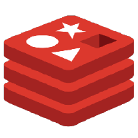
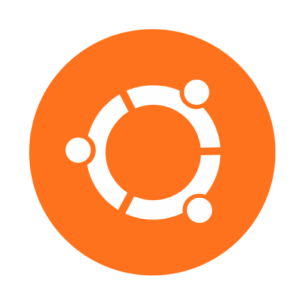
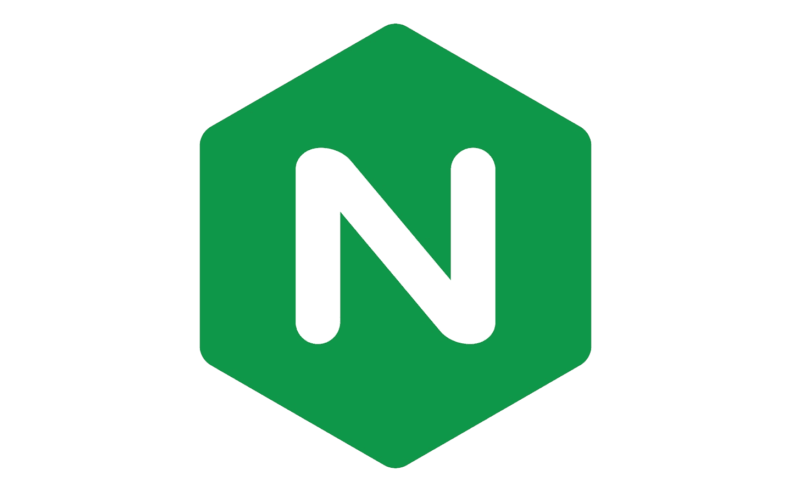

## Introduction

- 🌱 I’m currently learning web3
- ⚡ Fun fact: I transitioned from marketing to software development
- 👯 I’m looking to collaborate with others on open source projects

### Languages and Tools:

      

### Connect With Me:

<!--
**glanikali/glanikali** is a ✨ _special_ ✨ repository because its `README.md` (this file) appears on your GitHub profile.
-->
